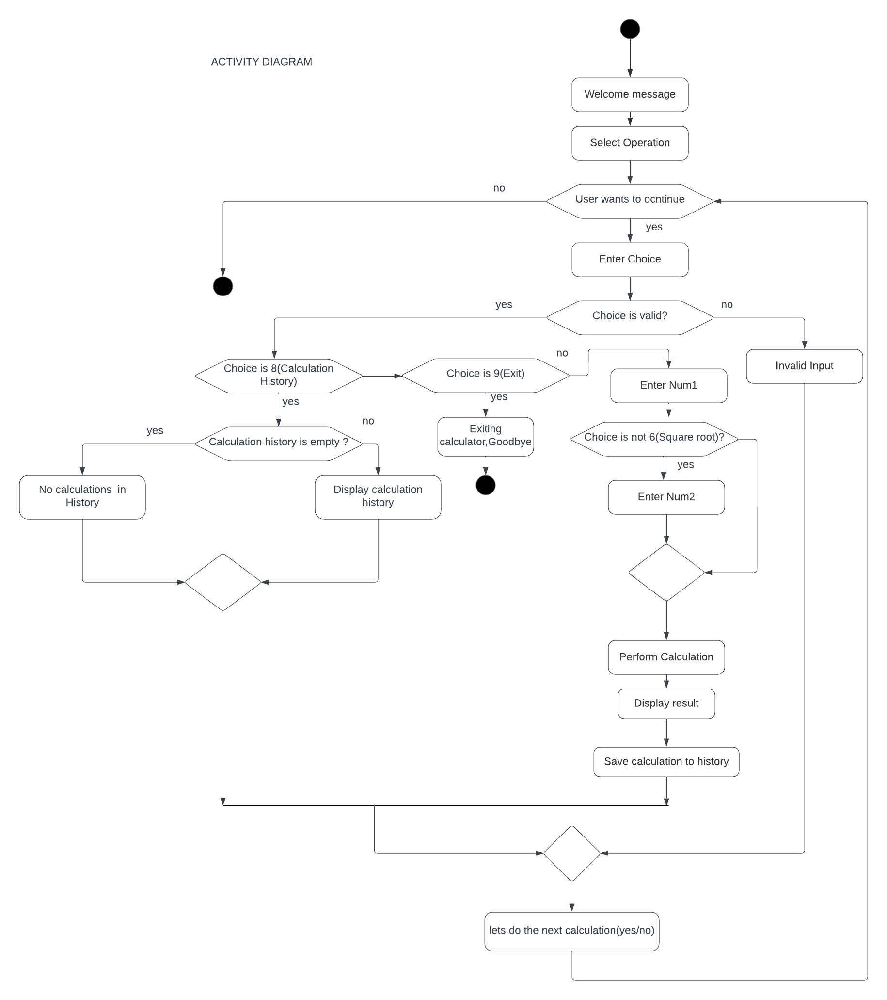
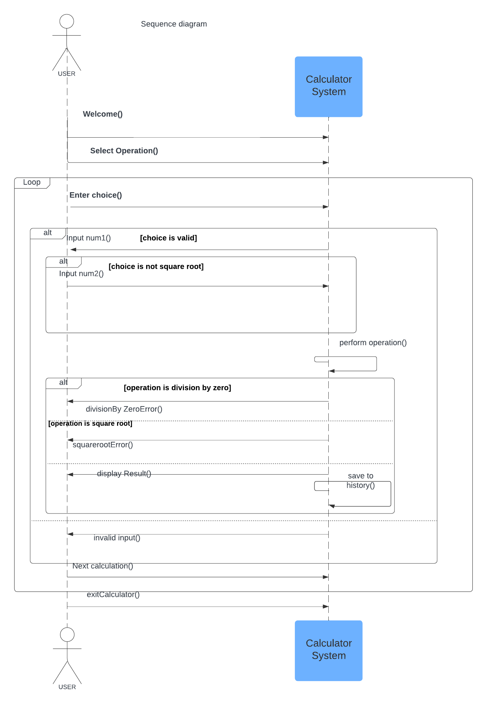
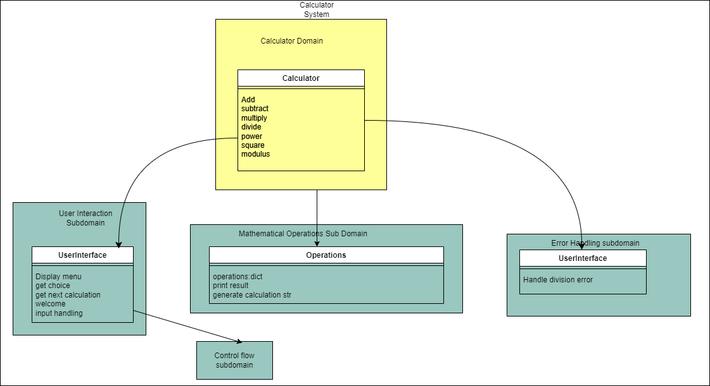
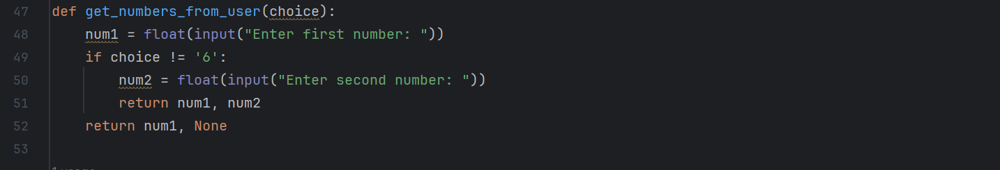
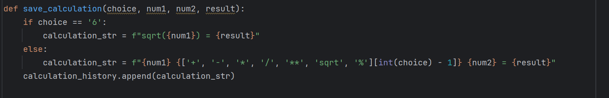
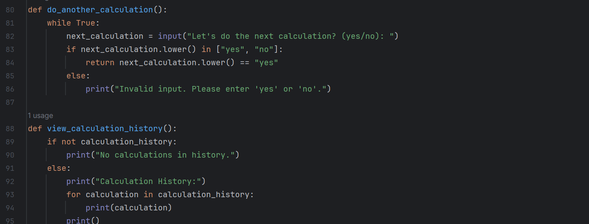
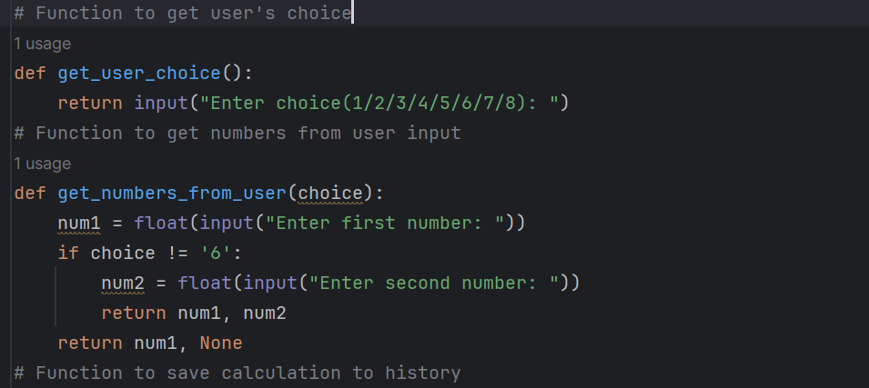
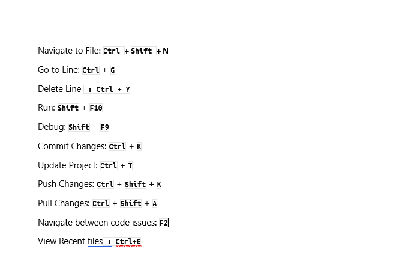

# Console based Python Calculator

A basic console based calculator implemented in Python.

## Features

- Basic arithmetic operations: addition, subtraction, multiplication,division,exponentiation, square root, and modulus.
- User-friendly command-line interface.
- Handles division by zero gracefully.
- Ability to view calculation History.

## Usage

To use the calculator, follow these steps:

1. Enter the desired operation:(Select Desired operation)
   - Type `1 for addition
   - Type `2` for subtraction
   - Type `3` for multiplication
   - Type `4` for division
   - Type `5` for Power
   - Type `6` for Squareroot
   - Type `7` for Modulus
   - Type `8` for Calculation History
   - Type `9` to Exit

2. Follow the prompts to enter the necessary values.

### Examples

```plaintext

>> Enter operation: 1
>> Enter first number: 5
>> Enter second number: 3
>> Result: 8

>> Enter operation: 4
>> Enter first number: 10
>> Enter second number: 0
>> Error: Cannot divide by zero. 

>> Enter operation: 9
>> Exiting Calculator. Goodbye

``````
# 2.UML

# 1.[**Use Case Diagram**](https://github.com/BIJIANZIL/Console_based_Python_Calculator/blob/main/WorkProcess/usecasediagram.png)
Here ,I have used lucid chart to basically design the Use Case Diagram.Here this basically gives the rough/basic structure of my project.It is actually a visual representation of how users interact with the system.It shows the different use cases and different types of users the system has.In this project ,some use cases are performing calculations,view calculation history,handling invalid input etc.


# 2.[**Activity Diagram:**](https://github.com/BIJIANZIL/Console_based_Python_Calculator/blob/main/WorkProcess/activitydiagram.png)
Activity diagram clearly shows every single step taken within this use case diagram,It represents the flow of control in the system and refer to the steps involved in the execution of each use case.In the activity diagram ,I have shown the control flow from start point to a finish point showing various decision paths that exit while activity is being executed.



# 3.[**Sequence Diagram:**](https://github.com/BIJIANZIL/Console_based_Python_Calculator/blob/main/WorkProcess/sequencediagram.png)
In the sequence diagram,communication between objects is illustrated using messages and we represent messages using arrows and represent the interaction between the objects in the order in which these interactions occur.




# 3.DDD

In Domain Driven Design,it emphasis on the importance of understanding the problem space of software and incorporating that understanding in to design and finally impelmenting in the software.Domain model represents the core concepts and entities within the domain.
In this project as my domain is too small,I have prepared DDD daiagram based on some future additions in the software.



# 4.METRICS

SonarQube is a code review tool that systematically helps us deliver Clean Code.It checks for bugs and vulnerabilities in the project and provide recommendations to resolve the code smells.Different versions of  sonarqube and finding the right JDK which supports seems litte difficult while  installation of  Sonarqube.We could easily track bugs,code smells ,Duplicated lines,Vulnerabilities etc.
Below are the snippets of metrics result:


# 5.Clean Code Development

# 1.Modular Design
In the calculator code,functions like add,subtract etc handle specific arithmetic operation.This aligns with the Single responsibility Principle(SRP),making the code modular and easy to maintain.Each function can be modified independently without affecting others.Functions like welcome(), add() ,multiply() etc are defined with clear responsibilities.•	Inside the main loop, functions like print_menu(),  get_numbers_from_user(), perform_operation(), print_result(), save_calculation(), do_another_calculation(), and view_calculation_history() are invoked in a sequential manner, following the flow of the calculator application. Each function encapsulates a specific part of the calculation process, making it easier to understand and maintain.





# 2.Proper input validation and Error Handling
The code includes input validation for numerical entries and handles potential errors, such as division by zero.This practice enhances user experience by providing clear feedback and prevents unexpected crashes.Error handling logic is encapsulated within functions, such as in the get_numbers_from_user() function where ValueError is caught for invalid user input.
This separation of concerns makes it easier to manage errors and handle them gracefully without cluttering the main calculation logic.

)

# 3.Descriptive names for variables and functions.
Variable names like num1 ,num2 and functions like add,subtract are clear and convey their purpose.This improves the code's self-documenting nature,reducing the need for excessive comments.With more descriptive names, it's easier to understand the purpose of each variable and function in the code, such as do_another_calculation(),  view_calculation_history(), etc.
Developers can easily understand the role of variables and functions without deep analysis.



# 4.User-Friendly Interface.
The program provides clear prompts and messages to guide the user through each step of the calculation process.It also offers the option to view calculation history enhancing the overall user experience.

# 5.Comments
Although the code is self-explanatory,few comments have been added to help someone understand the easiest way possible.


# 6.Separation of concerns:
Different concerns such as user input handling, menu display, operation execution, and calculation history management are separated into distinct functions. This promotes code organization and maintainability.


# 6.Build Management
To understand build management, I have selected Gradle build automation tool that supports multiple languages . It controls the development process in the tasks of compilation and packaging to testing,deployment and publishing.I set up a simple project in IntelliJ IDEA IDE running "Hello, World!" program in Java and used Groovy DSL (scripting build configurations ) and  generated documentation, and run the tests.

First I have created a new Gradle Project with Java as language and created Java class and wrote main.java program to print "Hello, World!".And wrote test class -MainTest to check if it is functioning properly.Understanding build.gradle- here is where is we define our project's configuration, dependencies, and tasks. IntelliJ IDEA provides excellent support for Gradle projects. Gradle provides tasks for running tests, such as the test task. We can execute this task to run all the tests in our project.<br/> . I have generated documents as well(./gradlew Javadoc)
# Build.gradle


# Main.java


# MainTest.java


<br/>Reference:[https://github.com/BIJIANZIL/Console_based_Python_Calculator/gradle-demo](https://github.com/BIJIANZIL/gradledemo.git) <br/>


# 7.Continous Delivery
Continous Integration is implemented by using GitHub Actions


# 8.Unit Tests
Unit test was also performed using Gradle on the same Java program.<br/>


# 9.IDE
Eventhough most frequently used IDE is Visual Studio Code & Jupiter Notebook,here I wanted to get familiarised with Pycharm as well. I have found features like syntax highlighting,refactoring,debugging more interesting.Also Pycharm includes features like  code completion ,navigation.
Below are the most favourite shortkeys I would like to mention.




# 10.DSL

While I was learning about DSL,I found this info most suitable for the understanding of DSL."If you wrote instructions to a paper which only some person or best friend can understand and no one else could .Then it may be a DSL.But if you wrote instruction in such terms which many people could understand and could follow then this is not DSL.
Domain Specific Languages allow us to capture complex business requirements in code written in the language of the customer.Once an ubiquitous language between you and your customer is defined and implemented as DSL,the code can quite literally be given back to the customer to edit and refine.

Here I have made a [daily expense tracker](https://github.com/BIJIANZIL/Console_based_Python_Calculator/blob/main/expense_tracker.dsl.txt) to record expenses ,view it and calculate the total expense with DSL and the Python code[daily_expense](https://github.com/BIJIANZIL/Console_based_Python_Calculator/blob/main/daily_expense.py) .
Run in cmd by python "daily_expense.py expense_tracker.dsl"


Below is the snapshhot for DSL demo:


# 11.Functional Programming

[1.Side Effect Free functions:](https://github.com/BIJIANZIL/Console_based_Python_Calculator/blob/6b842c97f71e17f0076e62f69412e8716a2f6cd8/main.py#L10)

Side-effect free functions are functions that do not modify any external state or have observable interactions with the outside world beyond returning a value.
In my code,most of the functions defined like add(x,y),divide(x,y) are side effect free.These functions only perform calculations or formatting without interacting with external resources or modifying any global state.

```
def add(x, y):
    return x + y
```


[2.Use of Higher order functions:]

Regarding the use of higher-order functions, my code doesn't explicitly use higher-order functions. Below ,i am showing code snippet explicitly explaining the use of Higher order functions.
Here "**apply_operation() " ** is a higher-order function that takes an operation function (add, subtract, multiply, or divide) and two numbers(x & y) as arguments, and then applies the operation function to the numbers.This allows us to re-use the code ,we can easily switch between different operations without modifying "**apply_operation() " ** itself.

```
# Define a higher-order function that takes a function as input
def apply_operation(operation, x, y):
    return operation(x, y)

# Define some basic arithmetic functions
def add(x, y):
    return x + y

def subtract(x, y):
    return x - y

def multiply(x, y):
    return x * y

def divide(x, y):
    if y != 0:
        return x / y
    else:
        return "Error: Cannot divide by zero"

# Usage example: Pass different operation functions to apply_operation
result_add = apply_operation(add, 5, 3)
print("Result of addition:", result_add)

result_subtract = apply_operation(subtract, 8, 2)
print("Result of subtraction:", result_subtract)

result_multiply = apply_operation(multiply, 4, 6)
print("Result of multiplication:", result_multiply)

result_divide = apply_operation(divide, 10, 2)
print("Result of division:", result_divide)

```


As my main code doesnt include all of these functional aspects, I wrote another code covering  all the functional aspects :
(Side effect free functions,use of higher order functions,functions as parameters and return values ,use of closures.)


[Sample Code:](https://github.com/BIJIANZIL/Console_based_Python_Calculator/blob/main/WorkProcess/Sample.py)

