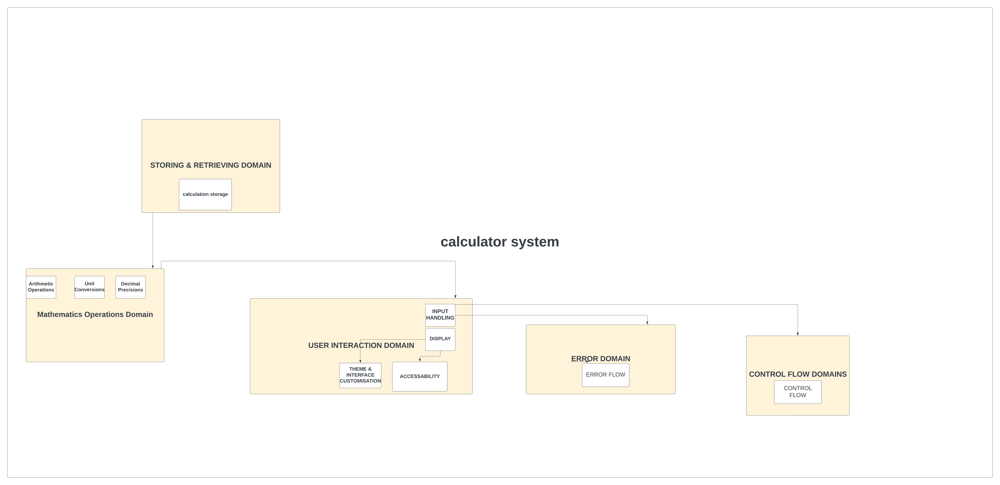

# Console based Python Calculator

A basic console based calculator implemented in Python.

## Features

- Basic arithmetic operations: addition, subtraction, multiplication,division,exponentiation, square root, and modulus.
- User-friendly command-line interface.
- Handles division by zero gracefully.
- Ability to view calculation History.

## Usage

To use the calculator, follow these steps:

1. Enter the desired operation:(Select Desired operation)
   - Type `1 for addition
   - Type `2` for subtraction
   - Type `3` for multiplication
   - Type `4` for division
   - Type `5` for Power
   - Type `6` for Squareroot
   - Type `7` for Modulus
   - Type `8` for Calculation History
   - Type `9` to Exit

2. Follow the prompts to enter the necessary values.

### Examples

```plaintext

>> Enter operation: 1
>> Enter first number: 5
>> Enter second number: 3
>> Result: 8

>> Enter operation: 4
>> Enter first number: 10
>> Enter second number: 0
>> Error: Cannot divide by zero. Please enter a valid divisor.

>> Enter operation: 9
>> Exiting Calculator. Goodbye

``````
# 2.UML

# 1.[**Use Case Diagram**](https://github.com/BIJIANZIL/Console_based_Python_Calculator/blob/main/usecasediagram.png)
Here ,I have used lucid chart to basically design the Use Case Diagram.Here this basically gives the rough/basic structure of my project.It is actually a visual representation of how users interact with teh system.It shows the different use cases and different types of users the system has.In this project ,some use cases are performing calculations,view calculation history,handling invalid input etc.


# 2.[**Activity Diagram:**](https://github.com/BIJIANZIL/Console_based_Python_Calculator/blob/main/activitydiagram.png)
Activity diagram clearly shows every single step taken within this use case diagram,It represents the flow of control in the system and refer to the steps involved in the execution of each use case.In the activity diagram ,I have shown the control flow from start point to a finish point showing various decision paths that exit while activity is being executed.


# 3.[**Sequence Diagram:**](https://github.com/BIJIANZIL/Console_based_Python_Calculator/blob/main/sequencediagram.png)
In sequence diagram,communication between objects is illustrated using messages and we represent messages using arrows and represent the interaction between the objects in the order in which these interactions occur.


# 3.DDD



# 4.METRICS

SonarQube is a code review tool that systematically helps us deliver Clean Code.It checks for bugs and vulnerabilities in the project and provide recommendations to resolve the code smells.
Below are the snippets of metrics:


# 5.Clean Code Development

# 1.Modular Design
In the calculator code,functions like add,subtract etc handle specific arithmetic operation.This aligns with the Single responsibility Principle(SRP),making the code modular and easy to maintain.Each function can be modified independently without affecting others.

# 2.Proper input validation and Error Handling
The code includes input validation for numerical entries and handles potential errors, such as division by zero.This practice enhances user experience by providing clear feedback and prevents unexpected crashes.

# 3.Descriptive names for variables and functions.
Variable names like num1 ,num2 and functions like add,subtract are clear and convey their purpose.This improves the code's self-documenting nature,reducing the need for excessive comments.
Developers can easily understand the role of variables and functions without deep analysis.

# 4.User-Friendly Interface.
The program provides clear prompts and messages to guide the user through each step of the calculation process.It also offers the option to view calculation history enhancing the overall user experience.

# 5.Comments
Although the code is self-explanatory,few comments have been added to help someone understand the easiest way possible.

# 6.Build Management
To understand build management, I have selected Gradle build automation tool that supports multiple languages . It controls the development process in the tasks of compilation and packaging to testing,deployment and publishing.I set up a simple project in IntelliJ IDEA IDE running "Hello, World!" program in Java and used Groovy DSL (scripting build configurations ) and  generated documentation, and run the tests.

First I have created a new Gradle Project with Java as language and created Java class and wrote main.java program to print "Hello, World!".And wrote test class -MainTest to check if it is functioning properly.Understanding build.gradle-here is where is we define our project's configuration, dependencies, and tasks. IntelliJ IDEA provides excellent support for Gradle projects. Gradle provides tasks for running tests, such as the test task. We can execute this task to run all the tests in our project.<br/>


<br/>Reference:[https://github.com/BIJIANZIL/Console_based_Python_Calculator/gradle-demo](https://github.com/BIJIANZIL/gradledemo.git) <br/>


# 7.Continous Delivery


# 8.Unit Tests
Unit test was also performed using Gradle on the same Java program.<br/>

![classmaintestresult]https://github.com/BIJIANZIL/Console_based_Python_Calculator/blob/main/classmaintestresult.png


# 9.IDE


# 10.DSL
Following is the snippet of Domain Specific language written in Groovy.
This is used to run the Java application on Gradle.
![image][https://github.com/BIJIANZIL/gradledemo/blob/master/build.gradle]


# 11.Functional Programming


