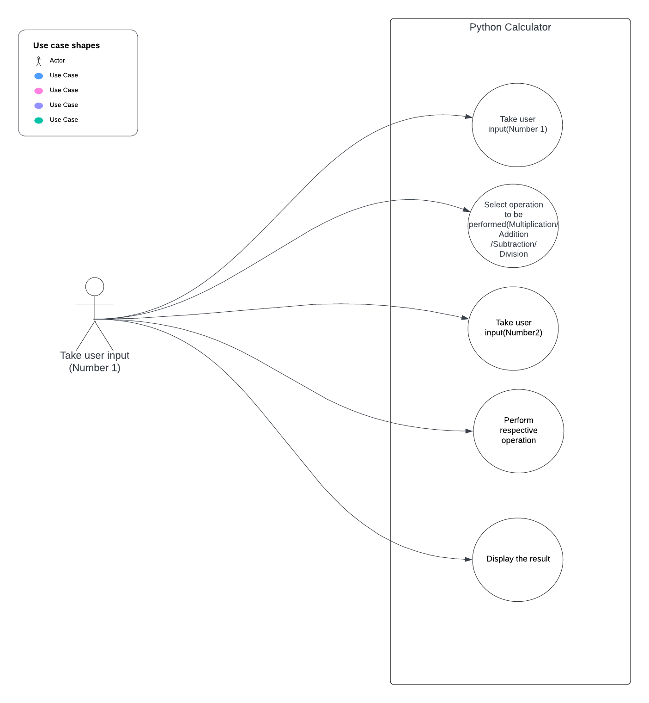

# Simple Python Calculator

A basic command-line calculator implemented in Python.

## Features

- Basic arithmetic operations: addition, subtraction, multiplication, and division.
- User-friendly command-line interface.
- Handles division by zero gracefully.

## Usage

To use the calculator, follow these steps:

1. Enter the desired operation:
   - Type `add` for addition
   - Type `subtract` for subtraction
   - Type `multiply` for multiplication
   - Type `divide` for division
   - Type `quit` to end the program

2. Follow the prompts to enter the necessary values.

### Examples

```plaintext
Enter 'add' for addition
Enter 'subtract' for subtraction
Enter 'multiply' for multiplication
Enter 'divide' for division
Enter 'quit' to end the program

>> Enter operation: add
>> Enter first number: 5
>> Enter second number: 3
>> Result: 8

>> Enter operation: divide
>> Enter first number: 10
>> Enter second number: 0
>> Error: Cannot divide by zero. Please enter a valid divisor.

>> Enter operation: quit
>> Program terminated.

## Usecasediagram



